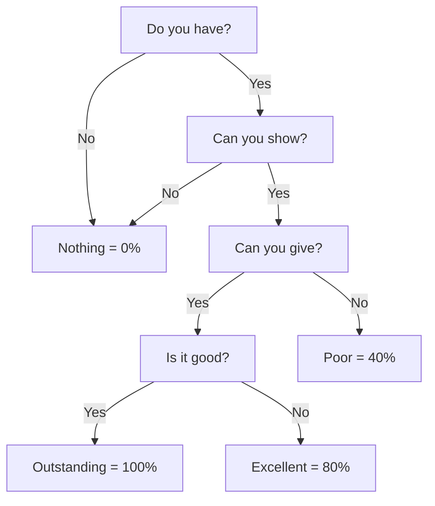

<!-- _class: center -->
# OPEN System: SQE Grading System
## Software Quality Engineering Process

#### Jaewoo Joung
#### November 23, 2024

---

# Introduction

- **Purpose**: Standardized approach to quality assessment
- **Scope**: All software quality engineering processes
- **Benefits**:
  - Consistent evaluation
  - Clear expectations
  - Measurable outcomes

---

# OPEN System Overview

## Core Principles
- Objective assessment
- Progressive evaluation
- Evidence-based grading
- Normalized scoring

---

# The Four Key Questions

---

# Question 1: "Do you have?"

## Key Aspects:
- Documentation completeness
- Resource availability
- Process definitions

### Expected Evidence:
1. Written documentation
2. Version control
3. Access permissions

---

# Question 2: "Can you show?"

## Demonstration Requirements:
- Live system access
- Working examples
- Process walkthrough

### Verification Methods:
1. System demos
2. Code reviews
3. Documentation reviews

---

# Question 3: "Can you give?"

## Knowledge Transfer:
- Training materials
- Documentation
- Peer reviews

### Collaboration Requirements:
- Team workshops
- Knowledge sharing sessions
- Documentation updates

---
# Question 4: "Is it good?"

## Quality Criteria:
- Performance metrics
- User satisfaction
- Code quality

## Assessment Methods:
- Peer reviews
- Metrics analysis
- User feedback

---

# Grading Levels

## Outstanding (100%)
- Complete documentation
- Excellent demonstration
- Effective knowledge transfer
- High quality delivery

## Excellent (80%)
- Good documentation
- Clear demonstration
- Adequate knowledge transfer

---

# Grading Levels (continued)

## Poor (40%)
- Incomplete documentation
- Limited demonstration
- Minimal knowledge transfer

## Nothing (0%)
- No documentation
- No demonstration
- No knowledge transfer

---

# Poor Compliance Warning

## Risk Factors:
- Incomplete documentation
- Poor knowledge transfer
- Lack of standardization

### Prevention:
1. Regular audits
2. Continuous monitoring
3. Team training

---

# Implementation Guidelines

## Best Practices:
1. Regular assessments
2. Clear documentation
3. Team collaboration
4. Continuous improvement

---

# Real-world Examples

## Success Stories:
- Project A: Implementation results
- Project B: Quality improvements

## Common Pitfalls:
- Incomplete documentation
- Poor communication
- Lack of follow-up

---

# Monitoring and Review

## Regular Assessment:
- Weekly reviews
- Monthly reports
- Quarterly audits

## Feedback Mechanisms:
- Team surveys
- Process reviews
- Improvement suggestions

---

<!-- _class: center -->
# Thank You!

## Questions?

Contact: jaewoo.joung@consultant.volvo.com
Department: Software Quality Engineering

