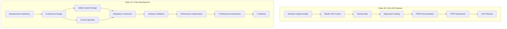

```mermaid
flowchart TB
    subgraph "Order 40: HUA LED Solution"
        SW40[Software Update Design]
        MOD40[Modify LED Control]
        TEST40[Testing Suite]
        REG40[Regression Testing]
        DOC40[PPAP Documentation]
        PPAP[PPAP Submission]
        SOP[SOP Release]

        SW40 --> MOD40
        MOD40 --> TEST40
        TEST40 --> REG40
        REG40 --> DOC40
        DOC40 --> PPAP
        PPAP --> SOP
    end

    subgraph "Order 41: E-fan Development"
        REQ41[Requirements Gathering]
        ARCH41[Architecture Design]
        SAFE41[Safety System Design]
        CTRL41[Control Algorithm]
        INT41[Integration Framework]
        TEST41[Testing & Validation]
        OPT41[Performance Optimization]
        DOC41[C-Release Documentation]
        REL41[C-Release]

        REQ41 --> ARCH41
        ARCH41 --> SAFE41
        ARCH41 --> CTRL41
        SAFE41 --> INT41
        CTRL41 --> INT41
        INT41 --> TEST41
        TEST41 --> OPT41
        OPT41 --> DOC41
        DOC41 --> REL41
    end

```
