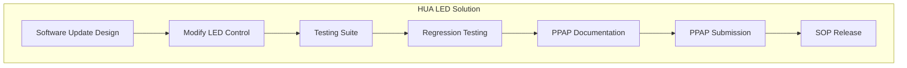
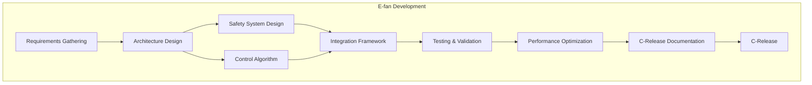
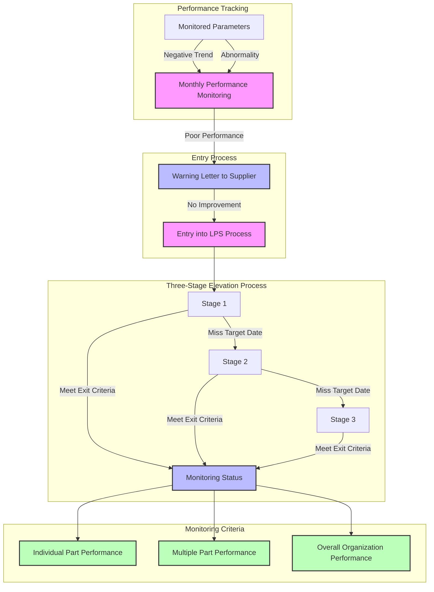
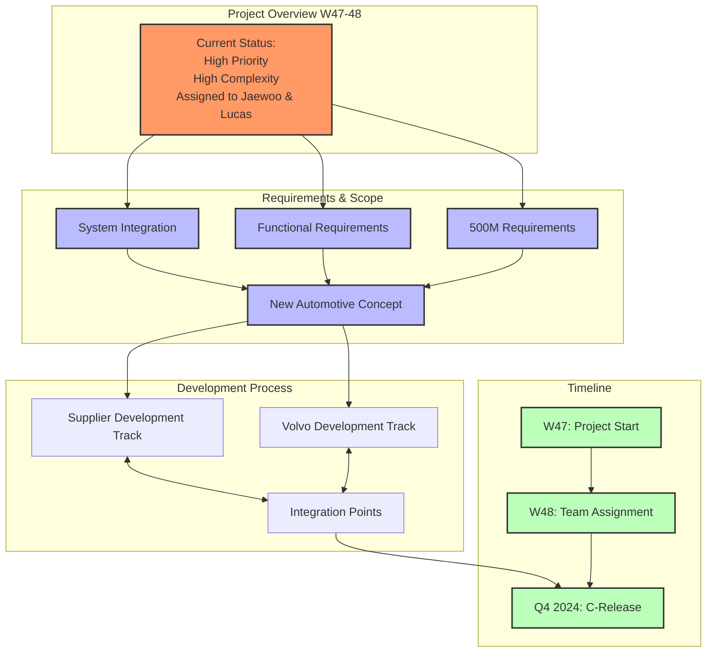

ID 40

```mermaid
flowchart TB
    subgraph "HUA LED Solution"
        SW40[Software Update Design]
        MOD40[Modify LED Control]
        TEST40[Testing Suite]
        REG40[Regression Testing]
        DOC40[PPAP Documentation]
        PPAP[PPAP Submission]
        SOP[SOP Release]

        SW40 --> MOD40
        MOD40 --> TEST40
        TEST40 --> REG40
        REG40 --> DOC40
        DOC40 --> PPAP
        PPAP --> SOP
    end
```

ID 41

```mermaid
flowchart TB
    subgraph "E-fan Development"
        REQ41[Requirements Gathering]
        ARCH41[Architecture Design]
        SAFE41[Safety System Design]
        CTRL41[Control Algorithm]
        INT41[Integration Framework]
        TEST41[Testing & Validation]
        OPT41[Performance Optimization]
        DOC41[C-Release Documentation]
        REL41[C-Release]

        REQ41 --> ARCH41
        ARCH41 --> SAFE41
        ARCH41 --> CTRL41
        SAFE41 --> INT41
        CTRL41 --> INT41
        INT41 --> TEST41
        TEST41 --> OPT41
        OPT41 --> DOC41
        DOC41 --> REL41
    end

```

LPS handling

```mermaid
flowchart TB
    start[Monthly Performance Monitoring]
    warning[Warning Letter to Supplier]
    entry[Entry into LPS Process]
    stage1[Stage 1]
    stage2[Stage 2]
    stage3[Stage 3]
    monitor[Monitoring Status]
    
    subgraph "Performance Tracking"
        metrics[Monitored Parameters]
        metrics --> |Negative Trend| start
        metrics --> |Abnormality| start
    end
    
    subgraph "Entry Process"
        start --> |Poor Performance| warning
        warning --> |No Improvement| entry
    end
    
    subgraph "Three-Stage Elevation Process"
        entry --> stage1
        stage1 --> |Meet Exit Criteria| monitor
        stage1 --> |Miss Target Date| stage2
        stage2 --> |Meet Exit Criteria| monitor
        stage2 --> |Miss Target Date| stage3
        stage3 --> |Meet Exit Criteria| monitor
    end
    
    subgraph "Monitoring Criteria"
        perf1[Individual Part Performance]
        perf2[Multiple Part Performance]
        perf3[Overall Organization Performance]
        
        monitor --> perf1
        monitor --> perf2
        monitor --> perf3
    end
    
    classDef process fill:#f9f,stroke:#333,stroke-width:2px
    classDef status fill:#bbf,stroke:#333,stroke-width:2px
    classDef criteria fill:#bfb,stroke:#333,stroke-width:2px
    
    class start,entry process
    class warning,monitor status
    class perf1,perf2,perf3 criteria

```
Project overview

```mermaid
flowchart TB
    subgraph "Project Overview W47-48"
        status[Current Status:<br/>High Priority<br/>High Complexity<br/>Assigned to Jaewoo & Lucas]
    end

    subgraph "Requirements & Scope"
        req1[System Integration]
        req2[Functional Requirements]
        req3[500M Requirements]
        tech[New Automotive Concept]
    end

    subgraph "Development Process"
        sup[Supplier Development Track]
        vol[Volvo Development Track]
        int[Integration Points]
        
        sup <--> int
        vol <--> int
    end

    subgraph "Timeline"
        start[W47: Project Start]
        progress[W48: Team Assignment]
        target[Q4 2024: C-Release]
    end

    classDef highlight fill:#f96,stroke:#333,stroke-width:2px
    classDef standard fill:#bbf,stroke:#333,stroke-width:2px
    classDef timeline fill:#bfb,stroke:#333,stroke-width:2px

    status --> req1 & req2 & req3
    req1 & req2 & req3 --> tech
    tech --> sup & vol
    int --> target
    start --> progress --> target

    class status highlight
    class req1,req2,req3,tech standard
    class start,progress,target timeline
```
